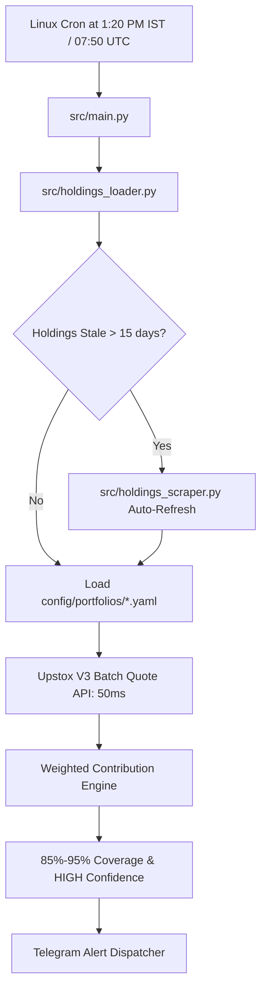

# Mutual Fund Intraday NAV Predictor & Dip-Buyer Alert

A lightweight, automated personal tool for calculating likely intraday NAV pressure across your mutual funds around **1:20 PM IST** (before the 2:00 PM / 3:00 PM AMC order cutoffs) to make informed lump-sum buy decisions.

---

## 🚀 Key Features

* **High Coverage (85%–95%) & HIGH Confidence**: Uses expanded fund portfolio disclosures across 30–50 holdings per fund instead of the standard 10-stock API limit.
* **Auto-Refreshing Disclosures**: Automatically fetches and updates monthly SEBI portfolio releases on-the-fly and via scheduled cron.
* **Ultra-Fast Upstox V3 Batch Pricing**: Queries real-time LTP and previous close for 150+ stocks simultaneously in <100ms.
* **Seamless Fallback**: Automatically falls back to `yfinance` history if an instrument key is unmapped or broker token expires.
* **Actionable Telegram Alerts**: Delivers color-coded daily status digests and Dip-Buying alerts (`🟢 BUY DIP`, `⚪ NORMAL`, `🛑 DO NOT BUY (Surging)`) directly to your Telegram.
* **Zero-Cost Oracle Cloud VM Ready**: Fully automated 1-click installer and Linux crontab scheduler.

---

## 🏛️ Architecture



---

## 🛠️ Quick Local Setup

### 1. Configure `.env`
Copy `.env.example` to `.env` and fill your credentials:
```bash
cp .env.example .env
```
Fill:
```text
UPSTOX_API_KEY=...
UPSTOX_API_SECRET=...
UPSTOX_ACCESS_TOKEN=...
TELEGRAM_ENABLED=true
TELEGRAM_BOT_TOKEN=...
TELEGRAM_CHAT_ID=...
```

### 2. Install Dependencies
```bash
python -m venv .venv
source .venv/bin/activate  # On Windows: .venv\Scripts\activate
pip install -r requirements.txt
```

### 3. Run Predictor
```bash
python src/main.py
```
*Use `--force` to run outside market hours or on holidays.*
*Use `--refresh-holdings` to scrape the latest online disclosures immediately.*

---

## ☁️ Deploy to Oracle Cloud Instance (OCI)

Deploying to an Oracle Cloud VM provides 100% reliable scheduling at 1:20 PM IST, completely independent of GitHub Actions queue drops.

### Step 1: Clone onto your Oracle Server
```bash
git clone <your-repo-url> ~/MFNAVTracker
cd ~/MFNAVTracker
```

### Step 2: Configure `.env`
```bash
cp .env.example .env
nano .env
```

### Step 3: Run One-Click Setup
```bash
chmod +x scripts/setup_oracle.sh
./scripts/setup_oracle.sh
```

**What this automatically sets up:**
1. Creates Python `.venv` and installs all dependencies.
2. Configures **Daily Intraday Cron** (`50 7 * * 1-5` $\rightarrow$ 1:20 PM IST Monday–Friday).
3. Configures **Monthly Holdings Auto-Refresh Cron** (`0 6 11 * *` $\rightarrow$ 11th of every month at 06:00 UTC).
4. Stores date-stamped execution logs in `logs/nav_YYYY-MM-DD.log`.

---

## 📊 Tracked Funds & Portfolio Config

Configured in `config/funds.yaml`:
* **Helios Flexi Cap Fund Direct Growth** (`config/portfolios/helios.yaml`)
* **Motilal Oswal Midcap Fund Direct Growth** (`config/portfolios/motilal_midcap.yaml`)
* **TrustMF Small Cap Fund Direct Growth** (`config/portfolios/trust_smallcap.yaml`)
* **Quant Multi Asset Allocation Fund Direct Plan** (`config/portfolios/quant_multiasset.yaml`)

---

## 💡 Lump Sum Strategy Guidelines

* **🟢 DIP DETECTED ($\le -1.0\%$):** Portfolio is under severe downward pressure. Deploy lump sum before 2:00 PM to lock in today's discounted NAV.
* **⚪ NORMAL RANGE ($-1.0\%$ to $+1.0\%$):** Normal market movement. No urgent lump sum trigger.
* **🛑 SURGE / PEAK ($\ge +1.0\%$):** Market is expensive today. Skip lump sum at intraday peaks.
