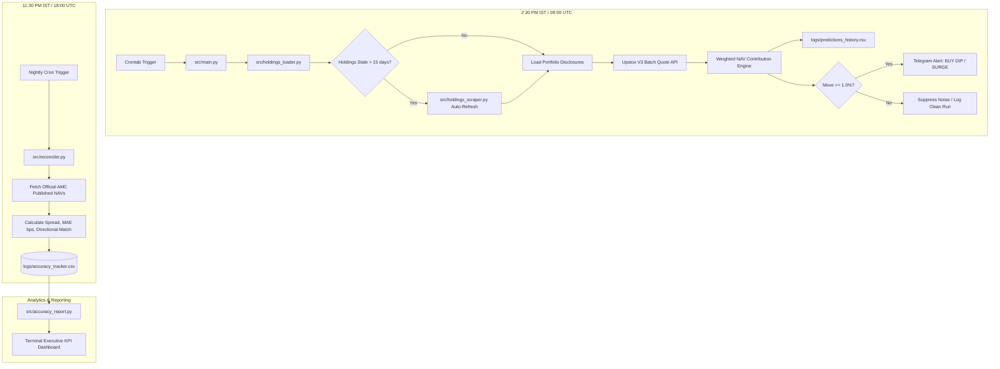

# Mutual Fund Intraday NAV Predictor & Automated Dip-Buyer

A high-precision, automated system for tracking intraday Mutual Fund NAV movements at **2:00 PM & 2:15 PM IST** (before the 2:30 PM broker same-day NAV cut-off) to inform lump-sum buy decisions with real-time Upstox V3 pricing, historical portfolio disclosures, and automated 30-day accuracy reconciliation.

---

## 🚀 Key Highlights

* **High Portfolio Coverage (85%–96%) & HIGH Confidence**: Evaluates 30–70 disclosed equity/ETF holdings per fund rather than standard top-10 limitations.
* **Auto-Refreshing Disclosures**: Automatically fetches and maintains monthly SEBI portfolio releases via Groww SSR state.
* **Sub-Second Upstox V3 Batch Pricing**: Fetches real-time LTP and previous close for 150+ stocks simultaneously via multi-token batching.
* **Intelligent Redundancy**: Falls back to `yfinance` daily bars if an instrument mapping or token expires.
* **Noise-Filtered Telegram Alerts**: Suppresses everyday noise and only alerts when actionable moves occur ($\ge \pm 1.0\%$).
* **Automated 30-Day Accuracy Tracking**: Logs all predictions and reconciles them nightly at 11:30 PM IST against official AMC published closing NAVs (calculating Mean Absolute Error in basis points, RMSE, and Directional Hit %).
* **Zero-Cost 24/7 Automation**: One-command deployment script for Oracle Cloud Always-Free VM crontabs.

---

## 🏛️ System Architecture



---

## ⏰ Schedule & Cut-Off Logic

Under SEBI regulations, same-day NAV realization requires orders and payments to be completed before the platform cut-off (typically **2:30 PM IST** on broker platforms like Groww, Zerodha Coin, and MF Central).

| Schedule | IST Time | UTC Time | Purpose |
| :--- | :---: | :---: | :--- |
| **Check 1 (Pre-Cutoff Pulse)** | **2:00 PM** | `08:30 UTC` | 30-min heads up to analyze trends & prepare orders |
| **Check 2 (Decision Cutoff)** | **2:15 PM** | `08:45 UTC` | Final calculation (15-min window before 2:30 PM cutoff) |
| **Nightly Reconciler** | **11:30 PM** | `18:00 UTC` | Audits predictions against published AMC NAVs |
| **Disclosures Refresh** | 1st, 11th, 21st | `06:00 UTC` | Scrapes latest monthly portfolio disclosures |

---

## 🛠️ CLI Utilities & Commands

### 1. Run Intraday Predictor Manually
```bash
# Standard run (respects market hours & holidays)
python src/main.py

# Force run (useful after-hours or on weekends)
python src/main.py --force

# Force test a Telegram alert delivery
python src/main.py --force --force-alert

# Refresh portfolio disclosures immediately from web sources
python src/main.py --refresh-holdings
```

### 2. View 30-Day Accuracy Report
Computes rolling Directional Accuracy (%), Mean Absolute Error (MAE in basis points & %), Root Mean Square Error (RMSE), and per-fund breakdowns:
```bash
# Default: Past 30 days
python src/accuracy_report.py

# Filter by time window or specific fund
python src/accuracy_report.py --days 14
python src/accuracy_report.py --fund helios
python src/accuracy_report.py --fund motilal_midcap
```

### 3. Run Nightly Reconciliation
Manually reconcile un-audited historical predictions against official AMFI/Yahoo NAVs:
```bash
python src/reconciler.py
```

### 4. Scrape Portfolio Disclosures
```bash
# Scrape all configured funds
python src/holdings_scraper.py --fund all

# Scrape a specific fund
python src/holdings_scraper.py --fund helios
```

---

## 📁 Tracked Funds Configuration

Fund definitions are configured in [`config/funds.yaml`](config/funds.yaml):

| Fund Key | Fund Name | Portfolio File |
| :--- | :--- | :--- |
| `helios` | Helios Flexi Cap Fund Direct Growth | `config/portfolios/helios.yaml` |
| `motilal_midcap` | Motilal Oswal Midcap Fund Direct Growth | `config/portfolios/motilal_midcap.yaml` |
| `trust_smallcap` | TrustMF Small Cap Fund Direct Growth | `config/portfolios/trust_smallcap.yaml` |
| `quant_multiasset` | Quant Multi Asset Allocation Fund Direct Plan | `config/portfolios/quant_multiasset.yaml` |

---

## ☁️ Oracle Cloud VM Deployment

### 1. Fresh Installation
```bash
git clone <your-repo-url> ~/MFNAVTracker
cd ~/MFNAVTracker
cp .env.example .env
nano .env   # Configure Upstox and Telegram credentials
chmod +x scripts/setup_oracle.sh
./scripts/setup_oracle.sh
```

### 2. One-Command Update (Pulls & Updates Crons)
```bash
cd ~/MFNAVTracker
./scripts/deploy.sh
```

---

## 💡 Strategy Decision Matrix

| Signal | Intraday NAV Estimate | Action |
| :--- | :---: | :--- |
| 🟢 **DIP DETECTED** | $\le -1.0\%$ | **Lump-Sum Buy:** Deploy capital before 2:30 PM to capture discounted closing NAV. |
| ⚪ **NORMAL RANGE** | $-1.0\%$ to $+1.0\%$ | **Hold / Skip:** Routine market volatility; no urgent lump-sum opportunity. |
| 🛑 **SURGE DETECTED** | $\ge +1.0\%$ | **Avoid Lump-Sum:** Market is surging; avoid buying into temporary intraday peaks. |
